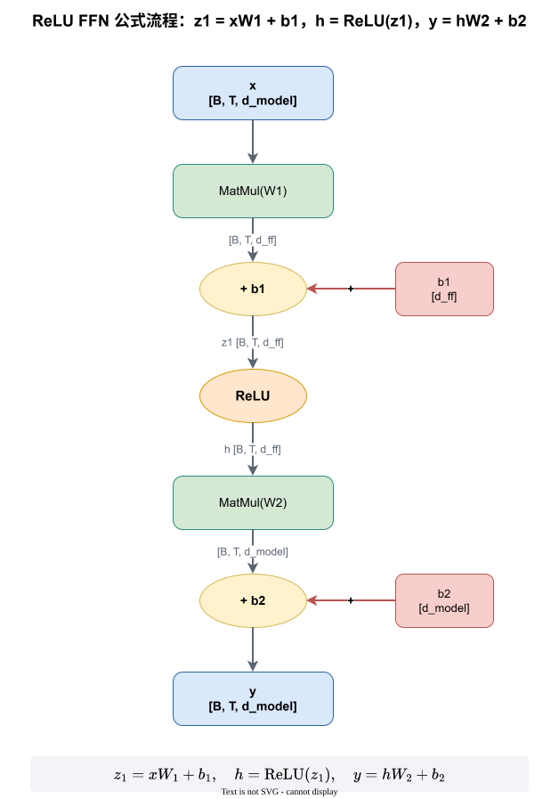
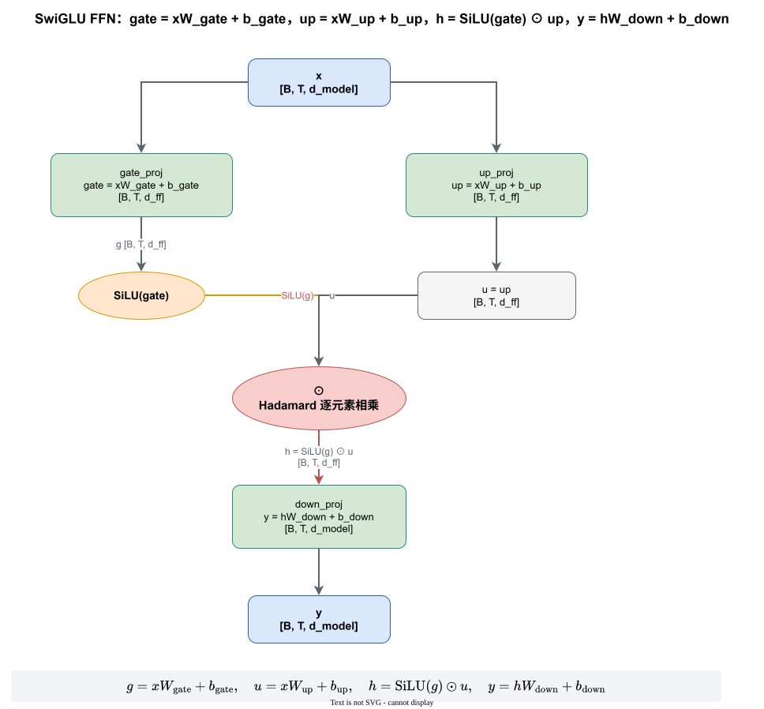
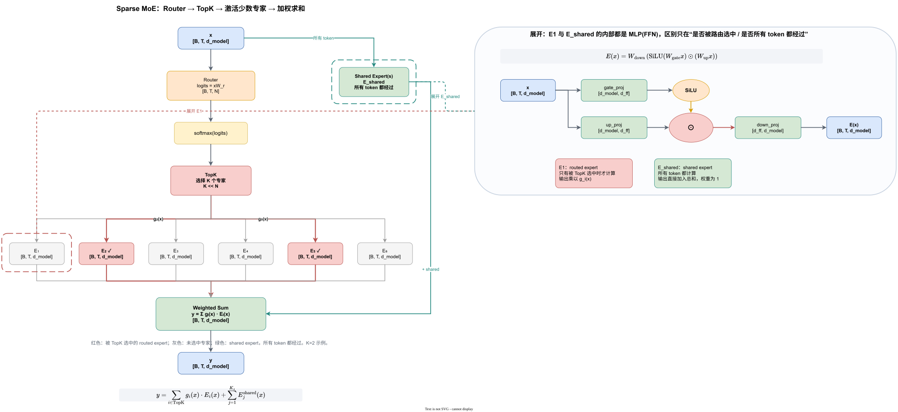

# MoE 与 FFN 原理及 vLLM / vLLM-Ascend 前馈融合算子

> 本文先从前面的 FFN / SwiGLU / MoE 三张图出发，展开前馈网络与稀疏专家模型的计算原理；再梳理 vLLM 与 vLLM-Ascend 中用于优化前馈层的常见融合算子和接口。文中所有数学符号均使用 LaTeX；渲染到网页时建议启用 MathJax 或 KaTeX。

## 一页结论

- FFN 是 Transformer 前馈层，本质是“升维 → 非线性 → 降维”的两层 MLP。
- SwiGLU FFN 把普通 FFN 的第一个线性投影拆成 `gate_proj` 和 `up_proj`，再做逐元素乘法，最后经 `down_proj` 降回 `d_model`。
- MoE 把 FFN 扩展为多个专家，并由 Router/TopK 选择少量专家；完整 MoE 输出需要同时包含 routed experts 与 shared experts。
- vLLM 在 FFN/MoE 上主要使用 fused grouped GEMM、token 对齐、量化与激活融合，降低 kernel 启动和访存开销。
- vLLM-Ascend 在 vLLM 基础上进一步使用 `npu_ffn`、`npu_grouped_matmul`、`npu_swiglu`、`npu_moe_gating_top_k_softmax`、`npu_moe_init_routing`、`npu_grouped_matmul_swiglu_quant_v2` 等 NPU 融合算子。

相关图文件：

- [ffn_formula_flow.drawio](E:/Desktop/业务/EP/ffn_formula_flow.drawio)：包含 ReLU FFN、SwiGLU FFN、Sparse MoE 三个 sheet
- [mlp_shape_flow.svg](E:/Desktop/业务/EP/mlp_shape_flow.svg)
- [moe_vs_ffn_diagram.svg](E:/Desktop/业务/EP/moe_vs_ffn_diagram.svg)

---

# 第 1 章 从 FFN 到 MoE 的前馈计算原理

## 1.1 普通 FFN：先升维，再降维

Transformer 的每个 token 经过 Attention 后进入 FFN。隐藏维度记为 $d_{\mathrm{model}}$，FFN 中间维度记为 $d_{\mathrm{ff}}$，通常 $d_{\mathrm{ff}} \approx 4 d_{\mathrm{model}}$。

输入张量：

```text
[B, T, d_model]
```

普通 ReLU FFN：

$$
z_1 = x W_1 + b_1,\qquad
h = \operatorname{ReLU}(z_1),\qquad
y = h W_2 + b_2
$$

对应矩阵形状：

```text
W1 : [d_model, d_ff]
b1 : [d_ff]
W2 : [d_ff, d_model]
b2 : [d_model]
```

shape 流转：

```text
[B, T, d_model]
      ↓  W1
[B, T, d_ff]
      ↓  ReLU
[B, T, d_ff]
      ↓  W2
[B, T, d_model]
```

这正好对应图 [mlp_shape_flow.svg](E:/Desktop/业务/EP/mlp_shape_flow.svg)。



## 1.2 SwiGLU FFN：把第一个投影拆成 gate 和 up

SwiGLU 是 LLM 中更常用的 FFN。它把普通 FFN 的 $W_1$ 拆成两个升维分支：

$$
u = x W_{\mathrm{up}} + b_{\mathrm{up}},\qquad
g = x W_{\mathrm{gate}} + b_{\mathrm{gate}}
$$

$$
h = \operatorname{SiLU}(g) \odot u,\qquad
y = h W_{\mathrm{down}} + b_{\mathrm{down}}
$$

其中：

$$
\operatorname{SiLU}(z) = z \odot \sigma(z),\qquad
\sigma(z)=\frac{1}{1+e^{-z}}
$$

三个投影的语义：

| 名称 | 含义 | Shape |
|---|---|---|
| `gate_proj` | 门控分支，决定哪些维度保留 | `[B, T, d_model] -> [B, T, d_ff]` |
| `up_proj` | 内容分支，承载候选信息 | `[B, T, d_model] -> [B, T, d_ff]` |
| `down_proj` | 降维投影，把结果压回隐藏维 | `[B, T, d_ff] -> [B, T, d_model]` |

因此 SwiGLU 可以理解为：

$$
y = \mathrm{down\_proj}\left(
\operatorname{activation}\left(\mathrm{gate\_proj}(x)\right)
\odot \mathrm{up\_proj}(x)
\right)
$$

这也是 [ffn_formula_flow.drawio](E:/Desktop/业务/EP/ffn_formula_flow.drawio) 中 SwiGLU sheet 的展开内容。



## 1.3 MoE：把一个 FFN 换成多个专家

稀疏 MoE 层把前馈层替换为 $N$ 个专家和一个 Router。每个专家通常就是一个小型 FFN/MLP，例如 SwiGLU MLP。

输入 $x$ 先经 Router 得到 logits：

$$
\ell = x W_r
$$

再经 softmax 和 Top-K 选择少数专家：

$$
g = \operatorname{TopK}\left(\operatorname{softmax}(\ell)\right)
$$

上面的书写顺序表示“先 softmax，再取 top-k”。少数模型（例如 Mixtral）使用 sigmoid 后再取 top-k，具体以模型定义为准；但“只保留少量专家并归一化权重”这一目标不变。

每个 token 只激活 $K \ll N$ 个 routed experts。完整输出应同时包含 shared experts：

$$
y = \sum_{i \in \mathrm{TopK}} g_i(x) E_i(x)
    + \sum_{j=1}^{K_s} E_j^{\mathrm{shared}}(x)
$$

其中：

- $E_i(x)$：routed expert，只有被 TopK 选中时计算，输出乘以 $g_i(x)$
- $E_j^{\mathrm{shared}}(x)$：shared expert，所有 token 都计算，输出直接加入总和

“shared expert 权重恒为 1”是本图为了讲清概念所做的简化。DeepSeek-V3 等实际模型还会对 shared expert 加一个可学习的线性门控，此时输出项写成 $\sum_j g^{\mathrm{shared}}_j(x)\,E_j^{\mathrm{shared}}(x)$。无论哪种写法，shared expert 都**不参与 sparse TopK 选择**，这是它与 routed expert 的本质区别。

专家内部计算与 SwiGLU FFN 相同：

$$
E(x) =
W_{\mathrm{down}}
\left(
\operatorname{SiLU}(W_{\mathrm{gate}} x)
\odot
(W_{\mathrm{up}} x)
\right)
$$

该结构对应 [moe_vs_ffn_diagram.svg](E:/Desktop/业务/EP/moe_vs_ffn_diagram.svg) 和 [ffn_formula_flow.drawio](E:/Desktop/业务/EP/ffn_formula_flow.drawio) 的 MoE sheet。



### MoE 计算过程的系统视角

在推理系统中，MoE 每层通常包括：

```text
Router / TopK
→ token dispatch
→ expert grouped GEMM
→ activation
→ down projection
→ token combine
```

因此优化前馈层不只是优化单个 FFN，还包括路由、调度、通信、分组矩阵乘和激活融合。

---

# 第 2 章 vLLM 与 vLLM-Ascend 中的前馈融合算子

## 2.1 vLLM：FusedMoE 与 grouped GEMM 主线

vLLM 的 MoE 执行入口已经模块化，核心由 `FusedMoEFactory` 创建。它把 Router、RoutedExperts、MoERunner 组合成完整执行管线：

```text
Router -> prepare/dispatch -> experts grouped GEMM -> finalize/combine
```

主要接口：

- `FusedMoEFactory`
- `fused_experts`
- `FusedMoEModularKernel`
- `FusedMoEMethodBase`

文档链接：

- [FusedMoEFactory API](https://docs.vllm.ai/en/v0.28.0/api/vllm/model_executor/layers/fused_moe/layer/)
- [Fused MoE Kernel Features](https://github.com/vllm-project/vllm/blob/main/docs/design/moe_kernel_features.md)
- [vLLM fused_moe.py 源码](https://github.com/vllm-project/vllm/blob/main/vllm/model_executor/layers/fused_moe/fused_moe.py)

### 2.1.1 `fused_experts` 做什么

`fused_experts` 的目标是把多个专家的两个 GEMM 和激活函数融合在一个 kernel 中。常见输入：

```text
hidden_states : [num_tokens, hidden_size]
w1            : [num_experts, intermediate_size * 2, hidden_size]
w2            : [num_experts, hidden_size, intermediate_size]
topk_weights  : [num_tokens, top_k]
topk_ids      : [num_tokens, top_k]
```

它内部做：

```text
token-expert 对齐
→ grouped GEMM：x @ w1^T
→ 激活 / SwiGLU
→ grouped GEMM：act @ w2^T
→ 加权聚合
```

好处是减少专家级 kernel 启动次数，避免把每个专家分别做小矩阵乘。

### 2.1.2 vLLM 支持的 experts kernel 类别

vLLM 上游按“输入格式 / 量化格式 / 激活函数 / 是否 modular”来分派 experts kernel，而不是固定一种实现。当前 main 分支的 `docs/design/moe_kernel_features.md` 列出的常见类别如下：

| Kernel 族 | 输入格式 | 量化类型 | 激活函数 | 是否 modular | 典型后端 |
|---|---|---|---|---|---|
| `triton`（`TritonExperts`） | standard | mxfp4/nvfp4/int4/int8/fp8 | silu, gelu, swigluoai 等 | 是 | Triton 通用实现 |
| `triton (batched)` | batched | 同上 | silu, gelu | 是 | 匹配 DeepEP low-latency |
| `deep gemm` | standard / batched | fp8 | silu, gelu | 是 | DeepGEMM/DeepEP |
| `cutlass_fp8` | standard / batched | fp8 | silu, gelu | 是 | CUTLASS |
| `cutlass_fp4` | standard / batched | nvfp4 | silu | 是 | CUTLASS |
| `flashinfer` | standard | nvfp4/fp8 | SwiGLU | 是 | FlashInfer |
| `marlin` | standard / batched | uint4/uint8/fp8/fp4 | silu, swigluoai | 是 | Marlin MoE |
| `trtllm` | standard | mxfp4/nvfp4 | SwiGLU | 是 | TRT-LLM kernel |
| `cpu_moe` | standard | 无 | silu/gelu 等 | 否 | CPU fallback |

这些 kernel 的共同目标相同：把专家 MLP 的 `gate/up` GEMM、激活函数、`down` GEMM 融合成一次或少数几次 kernel 调用，减少中间激活的往返读写。表中标注“batched”的变体对应先做 all2all dispatch 后按专家连续排列的 token 格式。

由于 vLLM 上游迭代较快，上表只作为“选择器”层面的概念图；具体类名、默认后端和量化组合应以实际使用的 vLLM 版本为准。

## 2.2 vLLM-Ascend：NPU 侧融合算子

vLLM-Ascend 在 vLLM 抽象下替换成 Ascend NPU 实现，核心文件主要在：

```text
vllm_ascend/ops/fused_moe/
vllm_ascend/quantization/
vllm_ascend/device/
```

关键组件：

| 组件 | 作用 |
|---|---|
| `AscendMoERunner` | 编排 routed / shared expert 执行 |
| `MoECommMethod` | 管理 dispatch-compute-finalize 通信 |
| `AscendRoutedExperts` | 专家权重、分组 GEMM、EP 映射 |
| `apply_moe_mlp` | 执行专家 MLP 计算 |

参考：

- [vLLM-Ascend Fused MoE Operations — DeepWiki](https://deepwiki.com/vllm-project/vllm-ascend/6.2-fused-moe-operations)
- [vLLM-Ascend fused_moe.py](https://github.com/vllm-project/vllm-ascend/blob/main/vllm_ascend/ops/fused_moe/fused_moe.py)
- [vLLM-Ascend moe_mlp.py](https://github.com/vllm-project/vllm-ascend/blob/main/vllm_ascend/ops/fused_moe/moe_mlp.py)

### 2.2.0 组件与底层算子的对应关系

vLLM-Ascend 并不是简单调用一个 `npu_ffn` 就完成整个 MoE 层。实际源码把“路由、调度、计算、激活、量化、回填”拆成不同层次：

| 阶段 | vLLM-Ascend 组件 | 实际落到 NPU 的算子/接口 |
|---|---|---|
| 路由 TopK | `DeviceOperator.moe_gating_top_k` | `torch.ops._C_ascend.moe_gating_top_k`；对外等价于 `torch_npu.npu_moe_gating_top_k_softmax` 的能力 |
| 路由初始化 | `DeviceOperator.npu_moe_init_routing` | `torch_npu.npu_moe_init_routing_v2` |
| token dispatch / combine | `MoETokenDispatcher` 各子类 | `npu_moe_distribute_dispatch/combine`、`npu_moe_token_permute/unpermute`、`npu_moe_finalize_routing` 等 |
| 专家 MLP（非量化） | `AscendUnquantizedFusedMoEMethod.apply_gmm1/apply_gmm2` | `torch_npu.npu_grouped_matmul` + `torch_npu.npu_swiglu` |
| 专家 MLP（量化） | `AscendW8A8DynamicFusedMoEMethod` 等 | `torch.ops._C_ascend.grouped_matmul_swiglu_quant_weight_nz` 系列 |
| 整体 FFN 融合 | CANN MegaMoE / FusedMC2 路径 | `torch.ops._C_ascend.dispatch_ffn_combine` |

也就是说：`npu_ffn` 属于 `torch_npu` 提供的高层 FFN/MoEFFN 融合 API，适合直接使用 Ascend PyTorch 扩展的用户；而 vLLM-Ascend 当前更多走 `npu_grouped_matmul`、`npu_swiglu` 和私有 `_C_ascend` 算子，以获得更细粒度的调度与量化控制。

### 2.2.1 `torch_npu.npu_ffn`

`npu_ffn` 是 Ascend 提供的 FFN/MoEFFN 融合算子。

接口：

```python
torch_npu.npu_ffn(
    x,
    weight1,
    weight2,
    activation,
    *,
    expert_tokens=None,
    expert_tokens_index=None,
    bias1=None,
    bias2=None,
    scale=None,
    offset=None,
    deq_scale1=None,
    deq_scale2=None,
    antiquant_scale1=None,
    antiquant_scale2=None,
    antiquant_offset1=None,
    antiquant_offset2=None,
    inner_precise=None,
    output_dtype=None,
)
```

非量化 FFN：

$$
y = \operatorname{activation}\left(x W_1 + b_1\right) W_2 + b_2
$$

量化场景：

$$
y = \left(\operatorname{activation}\left(\left(x W_1 + b_1\right) \odot d_1\right) \odot s + o\right) W_2 \odot d_2 + b_2
$$

其中 $d_1,d_2$ 对应 `deq_scale1/deq_scale2`，$s,o$ 对应 `scale/offset`。这里的 $\odot$ 在文档语义上表示按元素缩放/反量化，而不是矩阵乘。

当 `expert_tokens` 非空时，$W_1,W_2$ 变成三维 `[E,K,N]`，即执行 MoEFFN，可一次完成多个专家的前馈计算。

关键约束：

- `activation` 只支持 `fastgelu`、`gelu`、`relu`、`silu`、`geglu`、`swiglu`、`reglu`。
- SwiGLU 类激活（`geglu/swiglu/reglu`）要求 $N_1 = 2 K_2$；非 SwiGLU 类要求 $N_1 = K_2$。
- 通用维度约束为 $K_1 = N_2$，且 $K_1,K_2 < 65536$。
- SwiGLU 类激活的融合对整网小算子耗时占比有门槛要求，不是所有 FFN 都适合直接换 `npu_ffn`；性能劣化时应回退。

文档：

- [torch_npu.npu_ffn](https://www.hiascend.com/document/detail/zh/Pytorch/latest/apiref/customapi/docs/zh/custom_APIs/torch_npu/torch_npu-npu_ffn.md)
- [op-plugin npu_ffn 源码文档](https://gitcode.com/Ascend/op-plugin/blob/master/docs/zh/custom_APIs/torch_npu/torch_npu-npu_ffn.md)

### 2.2.2 `torch_npu.npu_grouped_matmul`

`npu_grouped_matmul` 实现分组矩阵乘，适合 MoE 中多个专家共享输入、但权重不同的计算。

作用：

```text
多个专家共享 hidden_states，但每个专家使用不同 weight
```

接口示例：

```python
outputs = torch_npu.npu_grouped_matmul(
    x=[hidden_states],
    weight=[w1],
    group_list=group_list,
    split_item=split_item,
)
```

它比逐专家循环调用 `matmul` 少很多 kernel 启动和访存开销。

文档：

- [torch_npu.npu_grouped_matmul](https://www.hiascend.com/document/detail/zh/Pytorch/60RC1/apiref/apilist/ptaoplist_000748.html)

### 2.2.3 `torch_npu.npu_swiglu`

`npu_swiglu` 提供硬件加速的 SwiGLU 激活：

$$
\operatorname{SwiGLU}(x) = \operatorname{Swish}(A) \odot B
$$

其中：

$$
\operatorname{Swish}(A) = A \odot \sigma(A),\qquad \sigma(A)=\frac{1}{1+e^{-A}}
$$

输入 `x` 会沿 `dim` 拆成两半：`A = x[..., :d/2]`，`B = x[..., d/2:]`。

接口：

```python
torch_npu.npu_swiglu(input, dim=-1)
```

文档：

- [torch_npu.npu_swiglu](https://www.hiascend.com/document/detail/zh/Pytorch/latest/apiref/customapi/docs/zh/custom_APIs/torch_npu/%EF%BC%88beta%EF%BC%89torch_npu-npu_swiglu.md)

### 2.2.4 MoE 路由算子

#### `torch_npu.npu_moe_gating_top_k_softmax`

完成：

$$
\left(g,\ e,\ r\right) = \operatorname{TopK}\left(\operatorname{softmax}(x W_r)\right)
$$

返回 topk weights $g$、expert index $e$、row index $r$。

接口：

```python
y, expert_idx, row_idx = torch_npu.npu_moe_gating_top_k_softmax(
    x,
    finished=None,
    k=top_k,
)
```

文档：

- [op-plugin npu_moe_gating_top_k_softmax](https://gitcode.com/Ascend/op-plugin/blob/bc7b52c3ab05c740f7987adaf24e1a9865b3e864/docs/zh/custom_APIs/torch_npu/torch_npu-npu_moe_gating_top_k_softmax.md)

#### `torch_npu.npu_moe_init_routing` / `npu_moe_init_routing_v2`

用于根据 topk 结果生成 token 到 expert 的调度信息，例如：

```text
expanded_x
expanded_row_idx
expanded_expert_idx
expert_token_nums
```

这替代了纯 Python 的 token 分配和 prefix sum。

以 vLLM-Ascend 当前实现为参考，实际调用形态是：

```python
hidden_states, expert_tokens, expanded_x, expanded_row_idx, expanded_expert_idx = (
    torch_npu.npu_moe_init_routing_v2(
        hidden_states,
        topk_ids,
        scale=scale,
        active_num=active_num,
        expert_num=expert_num,
        expert_tokens_num_type=expert_tokens_num_type,
        expert_tokens_num_flag=expert_tokens_num_flag,
        active_expert_range=active_expert_range,
        quant_mode=quant_mode,
    )
)
```

文档：

- [torch_npu.npu_moe_init_routing](https://www.hiascend.com/document/detail/zh/Pytorch/2610/apiref/customapi/docs/zh/custom_APIs/torch_npu/torch_npu-npu_moe_init_routing.md)
- [torch_npu.npu_moe_init_routing_v2](https://www.hiascend.com/document/detail/zh/Pytorch/2600/apiref/torchnpuCustomsapi/docs/zh/custom_APIs/torch_npu/torch_npu-npu_moe_init_routing_v2.md)

vLLM-Ascend 当前实际调用的是 `npu_moe_init_routing_v2`，其中 `expert_tokens_num_type` 有 0/1/2 三种模式：0 表示 cumsum，1 表示 count，2 表示另一种直方图模式。`group_list` 直接决定后续 `npu_grouped_matmul` 按哪些专家、多少 token 分组计算。

### 2.2.5 量化 + SwiGLU 融合

#### `torch_npu.npu_grouped_matmul_swiglu_quant_v2`

把：

```text
GroupedMatmul
→ dequant
→ SwiGLU
→ quant
```

融合为一个算子，适合 W8A8/W4A8 等量化 MoE。

文档：

- [torch_npu.npu_grouped_matmul_swiglu_quant_v2](https://www.hiascend.com/document/detail/zh/Pytorch/latest/apiref/customapi/docs/zh/custom_APIs/torch_npu/torch_npu-npu_grouped_matmul_swiglu_quant_v2.md)

注意：vLLM-Ascend 的 W8A8 动态量化 MoE 实际优先走私有算子 `torch.ops._C_ascend.grouped_matmul_swiglu_quant_weight_nz`；当启用 EPLB 且使用专家权重列表时走 `grouped_matmul_swiglu_quant_weight_nz_tensor_list`。这两个私有算子在语义上与 `torch_npu.npu_grouped_matmul_swiglu_quant_v2` 同源，都完成“分组矩阵乘 → 反量化/SwiGLU → 再量化”，但在权重格式（NZ）、专家列表和 EPLB 场景上做了专门适配。

### 2.2.6 GroupedMatMul + FinalizeRouting 融合

#### `torch_npu.npu_grouped_matmul_finalize_routing`

把：

```text
GroupedMatMul
→ MoeFinalizeRouting
```

融合，完成“分专家计算 → 按路由关系回填并聚合”，减少中间 Tensor 读写和 kernel 切换。

文档：

- [torch_npu.npu_grouped_matmul_finalize_routing](https://atomgit.com/Ascend/op-plugin/blob/fb102b6b2aca68ff369694c7c74471fc2283b33d/docs/zh/custom_APIs/torch_npu/torch_npu-npu_grouped_matmul_finalize_routing.md)

需要说明的是，vLLM-Ascend 的部分 dispatch 实现提到 `npu_moe_finalize_routing` 曾出现精度问题，因此 finalize/combine 侧有时改用 `torch_npu.npu_moe_token_unpermute`。`npu_grouped_matmul_finalize_routing` 则更适合“分组矩阵乘 + 回填聚合”一步完成的场景，二者都处在持续演进中。

## 2.3 融合算子和优化层次总结

| 层次 | vLLM | vLLM-Ascend |
|---|---|---|
| 路由 | `FusedMoERouter`、`select_experts` | `npu_moe_gating_top_k_softmax` |
| token 调度 | `moe_align_block_size` | `npu_moe_init_routing` / `v2` |
| 专家计算 | `fused_experts`、Triton/Cutlass/Marlin experts | `npu_grouped_matmul`、`apply_moe_mlp` |
| 激活融合 | SwiGLU 在 experts kernel 内融合 | `npu_swiglu` |
| FFN 融合 | `grouped_mlp` / fused experts | `npu_ffn` |
| 量化融合 | FP8/INT4 grouped GEMM | `npu_grouped_matmul_swiglu_quant_v2` |
| 结果聚合 | `finalize_weight_and_reduce` | `npu_grouped_matmul_finalize_routing` |

---

## 需要持续核对的点

- vLLM 上游接口迭代较快，具体函数签名以当前使用的 vLLM 版本文档为准。
- vLLM-Ascend 与 CANN/torch_npu 版本强绑定，接口可用性随 Ascend 硬件和 CANN 版本变化。
- `npu_ffn` 属于 `torch_npu` 高层 FFN/MoEFFN API，不是 vLLM-Ascend 当前 unquantized MoE 的主调用路径；vLLM-Ascend 更常用 `npu_grouped_matmul` + `npu_swiglu` 与 `_C_ascend` 定制算子。
- `npu_ffn` 对 GEGLU/SwiGLU/ReGLU 有门槛要求，不是所有 FFN 都适合直接融合，需要按文档做性能判断。
- `expert_tokens_num_type` 的 0/1/2 含义、量化 MoE 的 NZ 权重格式和 `_C_ascend` 私有算子均在演进，接入前应与目标 CANN 版本的对应文档核对。
